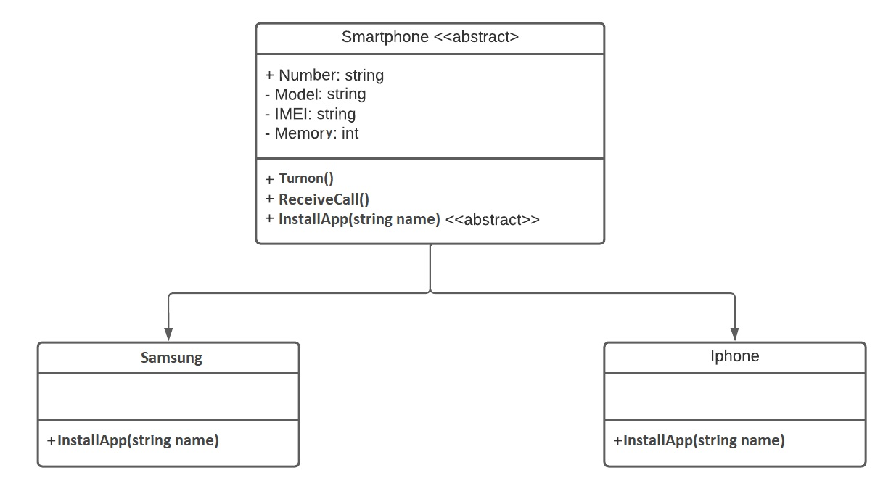

# Smartphone with POO in C Sharp

Project developed at Digital Innovation One's Pottencial .NET Developer Bootcamp with guidance from expert [Leonardo Buta](https://github.com/leonardo-buta/ "Leonardo Buta").

Learning to model a system that works with cell phones. It is necessary to make an abstraction of a cell phone and provide ways for different brands and models to have their own behavior, enabling greater code reuse and using object orientation.

[LICENSE](./LICENSE)
